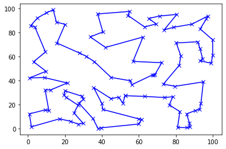

# travelling_salesman
 ## Постановка задачи
Вам дана карта, на которой отмечено N поселений. Поселения находятся на различном расстоянии друг от друга. Торговец отправляется из поселения N0. Предложите алгоритм, который позволит найти оптимальный маршрут для обхода всех N поселений и вернуться в точку старта.

 ## Решение задачи оптимизации методом отжига
### Имитация отжига
Пусть S – множество всех состояний (решений) нашей задачи. Пусть Si текущее состояние на i-ом шаге алгоритма. Пусть Т - температура на текущем шаге.

Для того, чтобы использовать имитацию отжига, нам понадобится определить три функции: 
1. Функцию энергии или, проще говоря, то что мы оптимизируем (E:S -> R). В данном случае это будет длина маршрута.
2. Функцию изменения температуры T с течением времени. Она должна быть убывающей, так что в текущей реализации выбран простой линейный вариант.
3. Функцию, порождающую новое состояние Si. В текущей реализации эта функция обращает случайную подпоследовательность городов в маршруте.

Если энергия состояния-кандидата меньше текущего, совершается переход в это состояние, иначе переход вероятностный (чтобы избежать застревания в локальном минимуме).

## Задача коммивояжера
В контексте данной задачи целевой функцией (функцией энергии) является сумма евклидовых расстояний между парой городов в маршруте.

